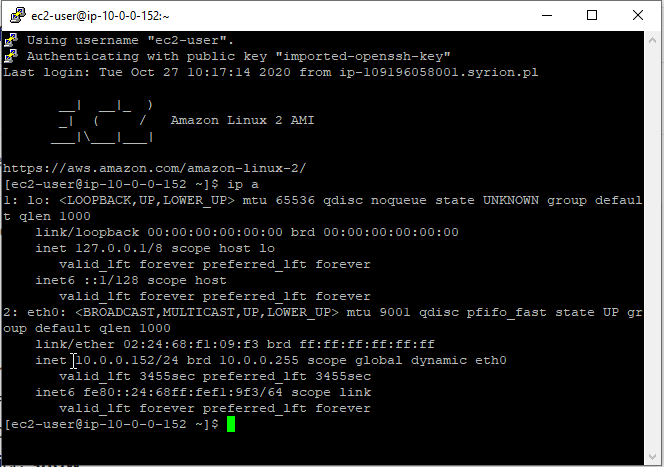

- [Security Groups](#security-groups)
- [Routing table](#routing-table)
- [Network access control list](#network-access-control-list)
- [Subnet](#subnet)
- [Create VPC with 2 public subnets](#create-vpc-with-2-public-subnets)
  - [Create EC2 instances that will be connected to created VPC](#create-ec2-instances-that-will-be-connected-to-created-vpc)
  - [Create and assign a public IP address to EC2 instance](#create-and-assign-a-public-ip-address-to-ec2-instance)
  - [Connect to the EC2 Instance via SSH](#connect-to-the-ec2-instance-via-ssh)
    - [Run PuTTYGent to convert pem file to ppk](#run-puttygent-to-convert-pem-file-to-ppk)
  - [Update EC2 instance and deploy the app](#update-ec2-instance-and-deploy-the-app)
    - [Update already installed components (in ssh console)](#update-already-installed-components-in-ssh-console)
    - [Install nodejs](#install-nodejs)
    - [Upload the app using WinSCP](#upload-the-app-using-winscp)
- [resources](#resources)

# Security Groups

A security group defines a collection of IPs that are allowed to connect to your instance and IPs that instance is allowed to connect to. Security groups are attached at the instance level (EC2) and can be shared among many instances. You can even set security group rules to allow access from other security groups instead of by IP.   

For example security group can be defined in EC2 wizard as one of its steps:


# Routing table

Each VPC has one **routing table**, which declares attempted destination IPs and where they should be routed to. For instance, if you want to run all outgoing traffic through a proxy, you can set a routing table rule to automatically send traffic to that IP. This can be a powerful tool for security as you can inspect outgoing traffic and only whitelist safe destinations for traffic.

# Network access control list

Another tool the VPCs use for networking control is the **network access control list**. Each VPC has one access control list, and this acts as an IP filtering table saying which IPs are allowed through the VPC for both incoming and outgoing traffic. Access control lists are kind of like super-powered security groups that apply rules for the entire VPC.

# Subnet

A VPC defines a private, logically isolated area for instances, but a **subnet** is where things really get interesting. Instances cannot be launched into just a VPC. They must also be launched into a subnet that is inside a VPC. A subnet is an additional isolated area that has its own CIDR block, routing table, and access control list. Subnets enable you to create different behavior in the same VPC. For instance, creating a public subnet that can be accessed and have access to the public internet and a private subnet that is not accessible from the internet and must go through a NAT gateway to access the outside world. With subnets, you can achieve very secure infrastructure for your instances.


# Create VPC with 2 public subnets


Update routing table to make possible to connect with Internet EC2 instances from this subnet.


By default there is only one route that says that any IP address referencing our local VPC CIDR block should resolve locally.


0.0.0.0/0 means anywhere.


Select pre-created internet gateway for your VPC. It will allow outgoing traffic to reach the outside world.


Create second subnet in second AZ - **single subnet can exist only in one AZ**. Use different CIDR to avoid collisions with already created subnet.


## Create EC2 instances that will be connected to created VPC


Create key pair to be able use SSH and download it (ec2-jacek-west1-keys.pem).


Click launch instances:


## Create and assign a public IP address to EC2 instance


Now we can see that EC2 instance has public IP Address:


## Connect to the EC2 Instance via SSH

### Run PuTTYGent to convert pem file to ppk

Click load to select pem file:


Select save private key to save if in ppk format.

Apply the ppk file in putty:


> :warning: from unknown reasons I had to generate ppk file 2 times, file that was created first time did not work.

To check user name that should be provided in putty select the instance in click connect:


Connect to the EC2 instance:




## Update EC2 instance and deploy the app

### Update already installed components (in ssh console)
```
sudo yum update
```


### Install nodejs
```
curl -sL https://rpm.nodesource.com/setup_14.x | sudo bash -
```


```
sudo yum install -y nodejs
```


Next we can check version

```
[ec2-user@ip-10-0-0-152 ~]$ node -v
v14.14.0
[ec2-user@ip-10-0-0-152 ~]$ npm -v
6.14.8
[ec2-user@ip-10-0-0-152 ~]$
```

### Upload the app using WinSCP

Install WinSCP and import defined session from PuTTY.   
Next upload the app to /home/ec2-user/sample-app. Before doing it remove **node_modules** folder from local app, these files will be download by EC2 instance later.


Next install necessary npms:


Next run the app:

```
[ec2-user@ip-10-0-0-152 sample-app]$ npm start

> pizza-luvrs@1.0.0 start /home/ec2-user/sample-app
> node index.js

Server running at: http://ip-10-0-0-152.us-west-1.compute.internal:3000
```

To run it in web browsers use public IP address because the EC2 instance does not have interface with public IP (it looks that it exist only in Elastic IP component).

Open in web browser this address ```http://52.53.108.154:3000/``` to see working app.


# resources
https://acloud.guru/forums/aws-certified-cloud-practitioner/discussion/-Lmu_Iq2Zrc_ojEYoN4d/I%20got%20a%20putty%20fatal%20error:%20No%20supported%20authentication%20methods%20available%20(server%20sent:publickey,gssapi-keyex,gssapi-with-mic)%20%20How%20do%20I%20resolve%20this%20issue%3F   
https://app.pluralsight.com/library/courses/aws-developer-getting-started/table-of-contents (chapters related with EC2 and putty)   
https://techviewleo.com/how-to-install-nodejs-on-amazon-linux/   