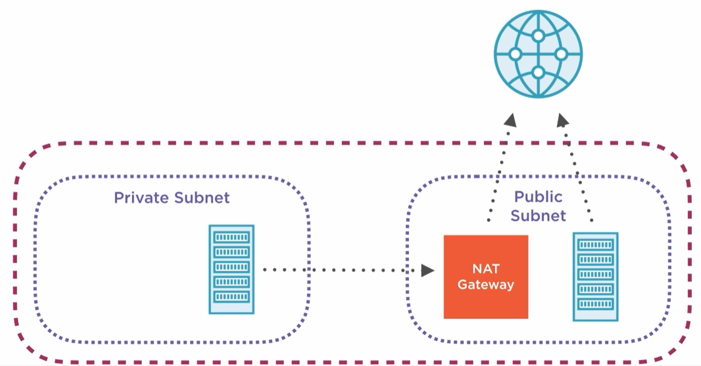

- [Security Groups](#security-groups)
- [Routing table](#routing-table)
- [Network access control list](#network-access-control-list)
- [Subnet](#subnet)
- [Create VPC with 2 public subnets](#create-vpc-with-2-public-subnets)

# Security Groups

A security group defines a collection of IPs that are allowed to connect to your instance and IPs that instance is allowed to connect to. Security groups are attached at the instance level (EC2) and can be shared among many instances. You can even set security group rules to allow access from other security groups instead of by IP.   

# Routing table

Each VPC has one **routing table**, which declares attempted destination IPs and where they should be routed to. For instance, if you want to run all outgoing traffic through a proxy, you can set a routing table rule to automatically send traffic to that IP. This can be a powerful tool for security as you can inspect outgoing traffic and only whitelist safe destinations for traffic.

# Network access control list

Another tool the VPCs use for networking control is the **network access control list**. Each VPC has one access control list, and this acts as an IP filtering table saying which IPs are allowed through the VPC for both incoming and outgoing traffic. Access control lists are kind of like super-powered security groups that apply rules for the entire VPC.

# Subnet

A VPC defines a private, logically isolated area for instances, but a **subnet** is where things really get interesting. Instances cannot be launched into just a VPC. They must also be launched into a subnet that is inside a VPC. A subnet is an additional isolated area that has its own CIDR block, routing table, and access control list. Subnets enable you to create different behavior in the same VPC. For instance, creating a public subnet that can be accessed and have access to the public internet and a private subnet that is not accessible from the internet and must go through a NAT gateway to access the outside world. With subnets, you can achieve very secure infrastructure for your instances.

# Create VPC with 2 public subnets

Update routing table to make possible to connect with Internet EC2 instances from this subnet.

By default there is only one route that says that any IP address referencing our local VPC CIDR block should resolve locally.

0.0.0.0/0 means anywhere.

Select pre-created internet gateway for your VPC. It will allow outgoing traffic to reach the outside world.

Create second subnet in second AZ - **single subnet can exist only in one AZ**. Use different CIDR to avoid collisions with already created subnet.

