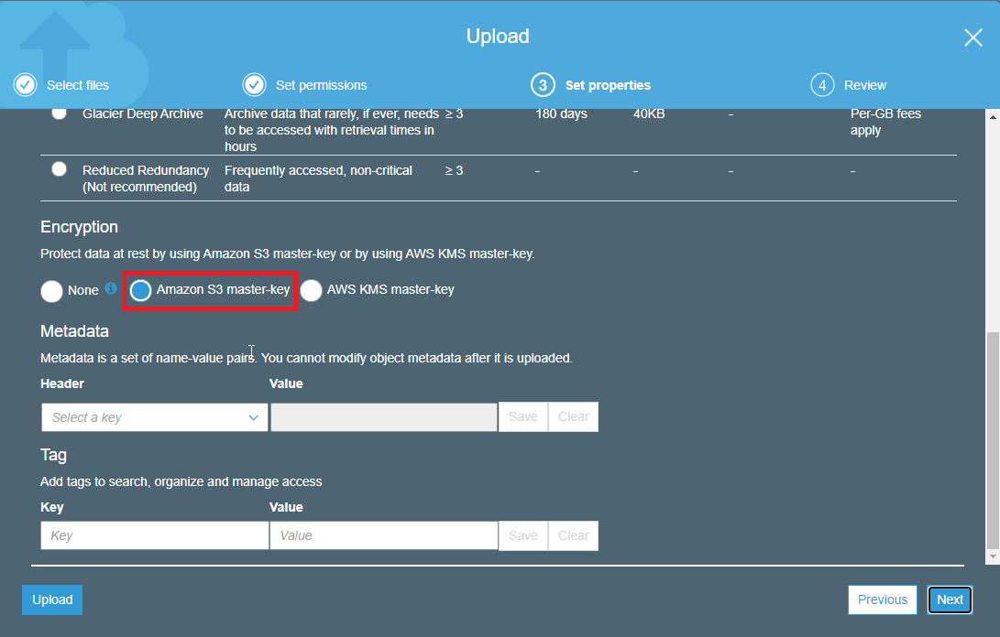

- [Interacting with AWS](#interacting-with-aws)
  - [AWS Console](#aws-console)
  - [AWS CLI](#aws-cli)
  - [AWS SDK](#aws-sdk)
- [EC2 (Elastic Compute)](#ec2-elastic-compute)
  - [EC2 instance types](#ec2-instance-types)
  - [Root device type](#root-device-type)
  - [Amazon Machine Image (AMI)](#amazon-machine-image-ami)
  - [Amazon EC2 purchase options](#amazon-ec2-purchase-options)
  - [Launching EC2 instances](#launching-ec2-instances)
- [AWS Elastic Beanstalk](#aws-elastic-beanstalk)
  - [Launching an App on Elastic Beanstalk](#launching-an-app-on-elastic-beanstalk)
- [AWS Lambda](#aws-lambda)
- [Content and Network Delivery Services](#content-and-network-delivery-services)
  - [Amazon VPS](#amazon-vps)
  - [Direct Connect](#direct-connect)
  - [Amazon Route 53](#amazon-route-53)
  - [Elastic load balancing](#elastic-load-balancing)
    - [Scaling on Amazon EC2](#scaling-on-amazon-ec2)
  - [Amazon CloudFront](#amazon-cloudfront)
  - [API Gateway](#api-gateway)
- [File Storage Services](#file-storage-services)
  - [S3](#s3)
  - [S3 Non-archival Storage Classes](#s3-non-archival-storage-classes)
  - [S3 Lifecycle policies](#s3-lifecycle-policies)
  - [S3 Transfer Acceleration](#s3-transfer-acceleration)
  - [Hosting static web site on S3](#hosting-static-web-site-on-s3)
  - [S3 Glacier](#s3-glacier)
  - [Elastic Block Store (EBS)](#elastic-block-store-ebs)
  - [Elastic File System (EFS)](#elastic-file-system-efs)
  - [FSx for Windows File Server](#fsx-for-windows-file-server)
  - [Snowball](#snowball)
  - [Snowmobile](#snowmobile)
- [Database Services and Utilities](#database-services-and-utilities)
  - [Amazon Relational Database Service (RDS)](#amazon-relational-database-service-rds)
  - [Amazon Aurora](#amazon-aurora)
  - [Amazon DynamoDB](#amazon-dynamodb)
  - [Amazon Redshift](#amazon-redshift)
  - [Amazon Elasticache](#amazon-elasticache)
  - [AWS Database Migration Service (DMS)](#aws-database-migration-service-dms)
- [App Integration Services](#app-integration-services)
  - [AWS Messaging Services](#aws-messaging-services)
    - [Amazon Simple Notification Service (SNS)](#amazon-simple-notification-service-sns)
    - [Amazon Simple Queue Service (SQS)](#amazon-simple-queue-service-sqs)
  - [AWS Step Functions](#aws-step-functions)
- [Management and Governance Services](#management-and-governance-services)
  - [AWS CloudTrail](#aws-cloudtrail)
  - [AWS CloudFormation](#aws-cloudformation)
  - [Amazon CloudWatch](#amazon-cloudwatch)
  - [AWS Config](#aws-config)
  - [AWS Systems Manager](#aws-systems-manager)
  - [AWS Control Tower](#aws-control-tower)
- [resources](#resources)

# Interacting with AWS

## AWS Console
UI in web browser.

## AWS CLI
Command line access for administering AWS resources.   

To use CLI first you have to generate Access Key ID and Secret Access Key in AWS IAM console.


Next run aws configure to store credentials locally:

```
C:\>aws configure
AWS Access Key ID [****************5OF5]:
AWS Secret Access Key [****************JZG0]:
Default region name [us-east-1]: us-east-2
Default output format [json]:
```

Next we can start using aws cli, for example

```
C:\>aws ec2 describe-instance-status --instance-id i-0fdd9ef82fa12
{
    "InstanceStatuses": [
        {
            "AvailabilityZone": "us-east-2c",
            "InstanceId": "i-0fdd9ef82fa12",
            "InstanceState": {
                "Code": 16,
                "Name": "running"
            },
```

In AWS CLI we can use profiles: https://docs.aws.amazon.com/cli/latest/userguide/cli-configure-profiles.html. You can configure additional profiles by using aws configure with the --profile option. A named profile is a collection of settings and credentials that you can apply to a AWS CLI command.
All AWS CLI credentials and settings are stored in files:   
   
%USERPROFILE%\.aws\credentials   
%USERPROFILE%\.aws\config

## AWS SDK
Programmatic access to manage AWS resources - supported by multiple languages.

# EC2 (Elastic Compute)

Amazon EC2 is a web service that provides resizable compute capacity in the cloud. It is designed to make web-scale computing easier for developers.

>NOTE: https://www.quora.com/Is-Amazon-EC2-IaaS-or-PaaS "Having said that, EC2 is IaaS and is probably the only AWS offering that falls into the IaaS category. Using EC2, AWS users can provision compute, networking and storage just by calling various APIs. Users can access the EC2 instances and their volumes as if they were provisioned in a non-cloud environment."


Can be used to:
* Web application hosting
* Batch processing
* Web services endpoint
* Desktop in the cloud

## EC2 instance types

* defines the processor, memory, and storage type
* cannot be changed without downtime
* provided in the following categories
  * general purpose
  * compute, memory and storage optimized
  * accelerated computing (for example machine learning)
* pricing is based on instance type

For example at 2020, they can be also different in different 
regions:


## Root device type

* Instance store: ephemeral storage that is physically attached to the host the virtual server is running on
* Elastic Block Store (EBS): persistent storage that exists separately from the host the virtual server is running.

Instance store - if you shout down your server all data will go away, EBS - if you shout down your server all data is still there.

https://docs.aws.amazon.com/AWSEC2/latest/UserGuide/RootDeviceStorage.html

## Amazon Machine Image (AMI)

**Template for an EC2 instance including configuration, operating system and data.**  

AWS provides many AMI`s that can be leveraged.

Custom AMI`s can be created based on your configuration.   

Commercial AMI`s are available in the AWS Marketplace.

## Amazon EC2 purchase options

* On-Demand: you pay the second for the instances that are launched.
* Reserved: you purchase at a discount for instances in advanced for 1-3 years.
  * All Upfront: entire cost for the 1 or 3 year period is paid upfront. It gives **maximum savings**.
  * Partial Upfront: part of 1 or 3 year cost is paid upfront along with a reduced monthly cost
  * No Upfront: no upfront payment is made but there will be a reduced monthly cost. It gives **minimum upfront cost**.
* Spot: you can leverage unused EC2 capacity in a region for a large discount.
  * Can provide up to 90% discount over on-demand pricing.
  * When you request instances, if your bid is higher than Spot price they will launch.
  * If the Spot price grows to exceed your bid, the instances will be terminated
  * Spot instances can be notified 2 minutes prior to termination


## Launching EC2 instances


 (click on the bottom *Next: Configure Instance Details*)


# AWS Elastic Beanstalk

* Automates the process of deploying and scaling workloads on EC2 **(PaaS)**
* Supports a specific set of technologies
* Leverages existing AWS services
* Only pay for the other services you leverage

Under the hood is used EC2 but Elastic Beanstalk manages provisioning, load balancing, scaling and monitoring.

Supported Application Platforms: Java, .NET, PHP, Node.js, Python, Ruby, Go, Docker.

Elastic Beanstalk Features:
* Monitoring
* Deployment
* Scaling
* EC2 Customization
  
Use Cases:
* Deploy an application with minimal knowledge of other services
* Reduce the overall maintenance needed for the application
* Few EC2 customizations are required

## Launching an App on Elastic Beanstalk

From https://docs.aws.amazon.com/elasticbeanstalk/latest/dg/tutorials.html download sample nodejs application.


# AWS Lambda

AWS Lambda lets you run code without provisioning or managing servers. You pay only for the compute time you consume. You can run code for virtually any type of application or backend service - all with zero administration.

* Enables the running of code **without provisioning infrastructure**.
* Can configure available memory from 128 MB to 3008 MB.   
* It is integrated with many AWS services.
* Enables event-driven workflows.
* Primary service for serverless architecture.
  

Advantages:
* Reduced maintenance requirements
* Enables fault tolerance without additional work - **multiple availability zones is done automatically**
* Scales based on demand
* Pricing is based on usage

# Content and Network Delivery Services

## Amazon VPS
Amazon Virtual Private Cloud (VPC) - is logically isolated section of the AWS Cloud where you can launch AWS resources in a virtual network that you define.

* it supports public and private subnets
* can utilize NA|T for private subnets
* enabled a connection to your data center
* can connect to other VPC
* supports private connections to many AWS services

## Direct Connect
A cloud service solution that makes it easy to establish a dedicated network connection from your data center to AWS.
It means that the traffic does not have to go through the public Internet.

## Amazon Route 53

* DNS: DNS changes are not instantaneous. Changes have to be propagated to all server over the globe and it can take even couple of hours. It manages public DNS records.
* Global AWS service (not regional) - all changes are saved globally
* HA: we can route users to different region in main region is not available
* enables global resource routing: send request to specific server based on what country they coming from or send request to the server that responds the fastest.

## Elastic load balancing

Elasticity: the ability for the infrastructure supporting an application to grow and contract based on how much it is used at a point in time.

* distributes traffic across multiple targets
* integrated with EC2, ECS and Lambda
* **supports one or more AZ`s (Availability Zones) in a region**
* types:
  * application load balancer (ALB)
  * network load balancer (NLB)
  * classic load balancer
  * ALB vs NLB: https://medium.com/awesome-cloud/aws-difference-between-application-load-balancer-and-network-load-balancer-cb8b6cd296a4

### Scaling on Amazon EC2
* vertical - scale up (e.g. adding faster CPU), system has to be shutted down to do the change.
* horizontal - scale out (e.g. adding more the same CPUs), system does not have to be shutted down to do the change. 

## Amazon CloudFront
* CDN
* enables users to get content from the server closest to them
* supports static and dynamic content
* utilizes AWS edge locations
* includes advanced security features
  * AWS Shield for DDoS
  * AWS WAF

## API Gateway
* fully managed API management service
* directly integrates with multiple AWS services
* provides monitoring & metrics on API calls
* supports VPC and on-premise private applications

# File Storage Services

## S3
* store files as objects in buckets. Bucket is unit of organization in S3.
* provides different storage classes for different use cases.
* stores data across multiple availability zones
* enabled URL access for files
* configurable rules for data lifecycle
* can serve as a static website host

## S3 Non-archival Storage Classes
* S3 Standard: default storage class and is for frequently accessed data
* S3 Intelligent-Tiering: automatically will move your data to the correct storage class based on usage
  * moves between frequent and infrequent access
  * same performance as S3-Standard
* S3 Standard-IA (infrequent access):  infrequently accessed data with the standard resilience
* S3 One Zone-IA is for infrequently access data that is only stored in one AZ

## S3 Lifecycle policies
* objects in a bucket can transition or expire based on your criteria
* transitions can enable objects to move to another storage class **based on time** (but you cannot move something based on usage - it is only available in *S3 Intelligent-Tiering*)
* expiration can delete object based on age
* policies can also factor in versions of a specific object in the bucket (for example delete all versions that are not current version and are older then 7 days)

## S3 Transfer Acceleration
Feature the can be enabled per bucket that allows for optimized uploading of data using AWS Edge Locations as a part of Amazon CloudFront.

## Hosting static web site on S3


Upload sample index.html file:


Use encryption to make sure that during uploading to S3 data is encrypted:



Try to open logo.png, it will fail. We have to configure permissions.


Add missing permissions for index.html:


## S3 Glacier
* designed for archiving of data within S3 as separate storage classes: for example we need to hold on payment information for 3 years to be able to produce these data for legal and compliance reasons but you will not access these data on regular basis
* offers configurable retrieval times: more often or less often
* can send files directly or through lifecycle rules in S3
* provides 2 different storage classes:
  * S3 Glacier
    * designed for archival data
    * 90 day minimum storage duration change (data must be stored at least 90 days)
    * can be retrieved in either minutes or hours
    * you pay a retrieval fee per GB retrieved
    * over 5 times less expensive than S3 Standard Storage Class
  * S3 Glacier Deep Archive
    * designed for archival data
    * 180 day minimum storage duration change (data must be stored at least 180 days)
    * can be retrieved in hours
    * you pay a retrieval fee per GB retrieved
    * over 23 times less expensive than S3 Standard Storage Class  
  
## Elastic Block Store (EBS)
Block storage designed **to be connected to a single EC2 instance** that can scale to support petabytes of data and supports multiple volume types based on need.

* enables redundancy within AZ
* allows users to take snapshots of its data
* offers encryptions of is volumes
* provide multiple volume types
  * general purpose SSD: is a cost effective type designed for general workloads
  * provisioned IOPS SSD: high performance volume for low latency applications
  * throughput optimized HDD: is designed for frequently accessed data
  * cold HDD: is designed for less frequently accessed workloads

## Elastic File System (EFS)
* fully managed NFS file system
* **designed for linux workloads**
* supports up to petabyte scale
* stores data across multiple AZ`s
* provide 2 different storage classes:
  * standard
  * infrequent access
* provides configurable lifecycle data rules (you can transition between *standard* and *infrequent access*)
* can be network file system that can be attached to multiple instances at the same time


## FSx for Windows File Server
* fully managed native Windows File system
* includes native Windows features like:
  * SMB
  * Active Directory Integration
  * Windows NTFS
* **utilizes SSD drives for low latency**

## Snowball
* service to physically migrate petabyte scale data to AWS.
* physical device is delivered by AWS
* you connect the snowball to your network and upload your data
* device is returned by local carrier
* AWS receives device and loads your data into S3

## Snowmobile
* service to physically migrate exabyte scale data onto AWS.
* ruggedized shipping container is delivered to your location
* AWS sets up a connection to your network
* you load your data on the snowmobile
* AWS will load data into S3 when the container is received at an AWS location

# Database Services and Utilities


## Amazon Relational Database Service (RDS)
* fully managed service for relational databases
* handles provisioning, patching, backup and recovery of your databases
* supports deployment across multiple availability zones
* some platforms support read replicas
* launches into a VPC
* two volume types:
  * general purpose SSD
  * provisioned IOPS SSD
* supported platforms
  * my sql
  * postgres SQL
  * MariaDB
  * Oracle DB
  * SQL Server
  * Amazon Aurora

## Amazon Aurora
Amazon Aurora (first supported RDS DB). It is a MySQL and PostgresSQL-compatible relational database built for the cloud, that combines the performance and availability of traditional enterprise databases with the simplicity and cost-effectiveness of open source databases.

## Amazon DynamoDB
* fully managed (SaaS) NoSQL database service
* provides both key-value and document databases
* enables extremely low latency at virtually any scale
* supports automated scaling based on configuration
* offers in-memory cache with the DynamoDB Accelerator (DAX)   
  
  >NOTE: "DynamoDB can handle more than 10 trillion requests per day and can support peaks of more than 20 million requests per second"

Use cases:
* scale without excessive maintenance
* good for serverless applications - because it is fully managed (SaaS)
* implementations where low latency is key
* data models without BLOB storage
## Amazon Redshift
* scalable data warehouse service (user behavior data, analytics data)
* supports petabyte scale warehousing of data
* leverages high performance disks and column storage
* offers the ability to fully encrypt contents
* provides isolation with a VPC
* enables querying of exabytes of data in Amazone S3 using Redshift Spectrum
* can be reserved to get greater discount
## Amazon Elasticache
* fully managed (SaaS) in-memory data stores
* supports both Memcached and Redis
* provides low latency in response times
* enables scaling and replicas to meet application demand
* handles common use cases including
  * database layer caching
  * session storage
## AWS Database Migration Service (DMS)
* enables you to move data into AWS from existing databases
* supports both one time and continual migration of data
* supports many popular commercial and open source databases
* only pay for compute leveraged in the migration process

# App Integration Services

## AWS Messaging Services

### Amazon Simple Notification Service (SNS)
* fully managed pub/sub messaging services
* enables you to create decoupled applications
* organized according to **topics**
* integrates with multiple AWS services
* provides end user notifications across SMS, email, and push notifications   
  

### Amazon Simple Queue Service (SQS)
* fully managed message queue service
* enables you to build decoupled and fault tolerant applications
* supports up to 256KB data payload
* allows messages to be stored up to 14 days (in case of topic we do not have access to historical messages in case new subscriber appears)
* two types of queues
  * standard queue
  * FIFO


## AWS Step Functions
* serverless workflow management service
* enables orchestration of workflows through a fully managed service
* supports serverless architecture
* can support complex workflows including error handling
* charged per state transition along with the other AWS services leveraged
* workflows are defined using Amazon States Language


# Management and Governance Services

## AWS CloudTrail
>"With CloudTrail, you can log, continuously monitor, and retain **account activity** related to actions across your AWS infrastructure. CloudTrail provides event history of your AWS account activity, including actions taken through the AWS Management Console, AWS SDKs, command line tools, and other AWS services."
* inserts audit trail in an S3 bucket or into CloudWatch Logs
* logs events in the regions in which they occur
* meets many compliance requirements for infrastructure auditing
* as a best practice, it should be enabled on every AWS account
* can be consolidated into an Organizational trail using AWS Organizations
* by default, the log files delivered by CloudTrail to your S3 bucket are encrypted using server-side encryption with Amazon S3–managed encryption keys (SSE-S3)

Use cases:
* compliance requirement
* forensic analysis
* operational analysis
* troubleshooting

## AWS CloudFormation
* managed service for provisioning infrastructure based on templates
* no additional charge
* templates in YAML or JSON
* enables infrastructure as code
* manages dependencies between resources
* provides drift detection to find changes in infrastructure
## Amazon CloudWatch
* **monitoring and management service**
* provides metrics, logs and alarms for infrastructure
* enables alarms based on metrics
* provides visualization capabilities for metrics
* allows for custom dashboards based on collected metrics
## AWS Config
>"AWS Config continuously monitors and records your AWS resource configurations and allows you to automate the evaluation of recorded configurations against desired configurations."
* continually evaluates infrastructure against a set of rules
* provides configuration history for infrastructure
* works against rules that you can customize or even create custom validations
* includes conformance packs for **compliance standards including PCI-DSS**
* can work with AWS Organizations for both cross-region and cross-account setup
* provides remediation steps for infrastructure not meeting criteria
## AWS Systems Manager
>"Provides a unified user interface so you can view operational data from multiple AWS services and allows you to automate operations tasks across your AWS resources"
* allows to access and manage all AWS Services
* provides operational data and automation across infrastructure
* provides multiple tools that make it easier to manage your AWS infrastructure
* enables automation tasks for common maintenance actions
* gives a secure way to access servers using only AWS credentials
* stores commonly used parameters securely for operational use

## AWS Control Tower
>"A service to create a multi-account environment on AWS that follows the recommended best practices in operational efficiency, security, and governance."
* centralized user across all AWS accounts
* provides a way to create new AWS accounts based on templates
* integrates Guardrials for accounts
* includes a dashboard to gain operational insights from a single view
# resources
https://app.pluralsight.com/library/courses/understanding-aws-core-services/table-of-contents