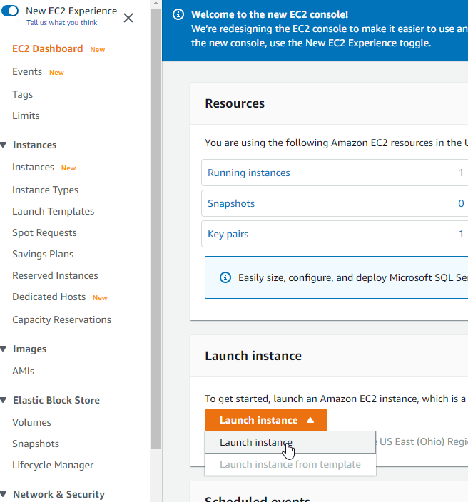

# Interacting with AWS

## AWS Console
UI in web browser.

## AWS CLI
Command line access for administering AWS resources.   

To use CLI first you have to generate Access Key ID and Secret Access Key in AWS IAM console.


Next run aws configure to store credentials locally:

```
C:\>aws configure
AWS Access Key ID [****************5OF5]:
AWS Secret Access Key [****************JZG0]:
Default region name [us-east-1]: us-east-2
Default output format [json]:
```

Next we can start using aws cli, for example

```
C:\>aws ec2 describe-instance-status --instance-id i-0fdd9ef82fa12
{
    "InstanceStatuses": [
        {
            "AvailabilityZone": "us-east-2c",
            "InstanceId": "i-0fdd9ef82fa12",
            "InstanceState": {
                "Code": 16,
                "Name": "running"
            },
```

In AWS CLI we can use profiles: https://docs.aws.amazon.com/cli/latest/userguide/cli-configure-profiles.html. You can configure additional profiles by using aws configure with the --profile option. A named profile is a collection of settings and credentials that you can apply to a AWS CLI command.
All AWS CLI credentials and settings are stored in files:   
   
%USERPROFILE%\.aws\credentials   
%USERPROFILE%\.aws\config

## AWS SDK
Programmatic access to manage AWS resources - supported by multiple languages.

# EC2 (Elastic Compute)

Amazon EC2 is a web service that provides resizable compute capacity in the cloud. It is designed to make web-scale computing easier for developers.

>NOTE: https://www.quora.com/Is-Amazon-EC2-IaaS-or-PaaS "Having said that, EC2 is IaaS and is probably the only AWS offering that falls into the IaaS category. Using EC2, AWS users can provision compute, networking and storage just by calling various APIs. Users can access the EC2 instances and their volumes as if they were provisioned in a non-cloud environment."


Can be used to:
* Web application hosting
* Batch processing
* Web services endpoint
* Desktop in the cloud

## EC2 instance types

* defines the processor, memory, and storage type
* cannot be changed without downtime
* provided in the following categories
  * general purpose
  * compute, memory and storage optimized
  * accelerated computing (for example machine learning)
* pricing is based on instance type

For example at 2020, they can be also different in different 
regions:


## Root device type

* Instance store: ephemeral storage that is physically attached to the host the virtual server is running on
* Elastic Block Store (EBS): persistent storage that exists separately from the host the virtual server is running.

Instance store - if you shout down your server all data will go away, EBS - if you shout down your server all data is still there.

## Amazon Machine Image (AMI)

**Template for an EC2 instance including configuration, operating system and data.**  

AWS provides many AMI`s that can be leveraged.

Custom AMI`s can be created based on your configuration.   

Commercial AMI`s are available in the AWS Marketplace.

## Amazon EC2 purchase options

* On-Demand: you pay the second for the instances that are launched.
* Reserved: you purchase at a discount for instances in advanced for 1-3 years.
  * All Upfront: entire cost for the 1 or 3 year period is paid upfront. It gives **maximum savings**.
  * Partial Upfront: part of 1 or 3 year cost is paid upfront along with a reduced monthly cost
  * No Upfront: no upfront payment is made but there will be a reduced monthly cost. It gives **minimum upfront cost**.
* Spot: you can leverage unused EC2 capacity in a region for a large discount.
  * Can provide up to 90% discount over on-demand pricing.
  * When you request instances, if your bid is higher than Spot price they will launch.
  * If the Spot price grows to exceed your bid, the instances will be terminated
  * Spot instances can be notified 2 minutes prior to termination


## Launching EC2 instances




 (click on the bottom *Next: Configure Instance Details*)


# AWS Elastic Beanstalk

* Automates the process of deploying and scaling workloads on EC2 **(PaaS)**
* Supports a specific set of technologies
* Leverages existing AWS services
* Only pay for the other services you leverage

Under the hood is used EC2 but Elastic Beanstalk manages provisioning, load balancing, scaling and monitoring.

Supported Application Platforms: Java, .NET, PHP, Node.js, Python, Ruby, Go, Docker.

Elastic Beanstalk Features:
* Monitoring
* Deployment
* Scaling
* EC2 Customization
  
Use Cases:
* Deploy an application with minimal knowledge of other services
* Reduce the overall maintenance needed for the application
* Few EC2 customizations are required

## Launching an App on Elastic Beanstalk

# resources
https://app.pluralsight.com/library/courses/understanding-aws-core-services/table-of-contents