# Create AWS account

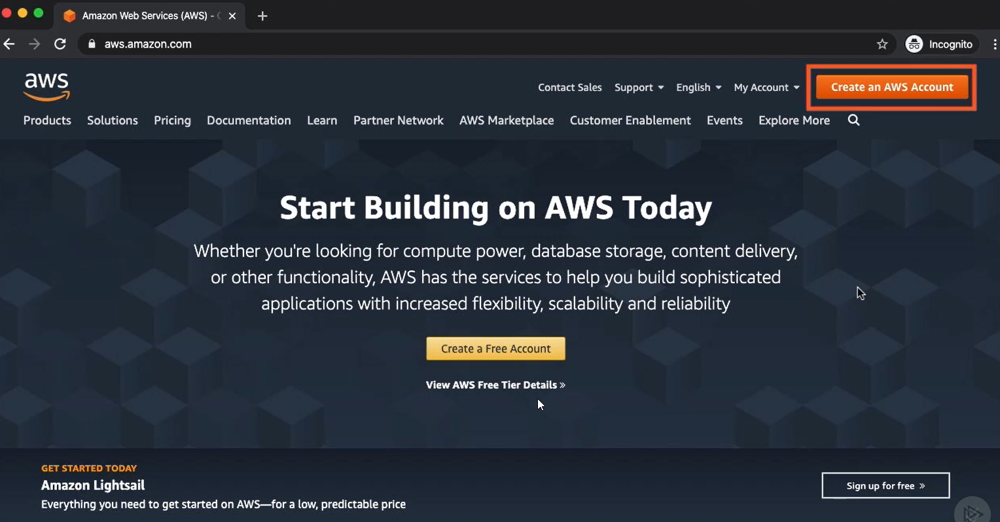
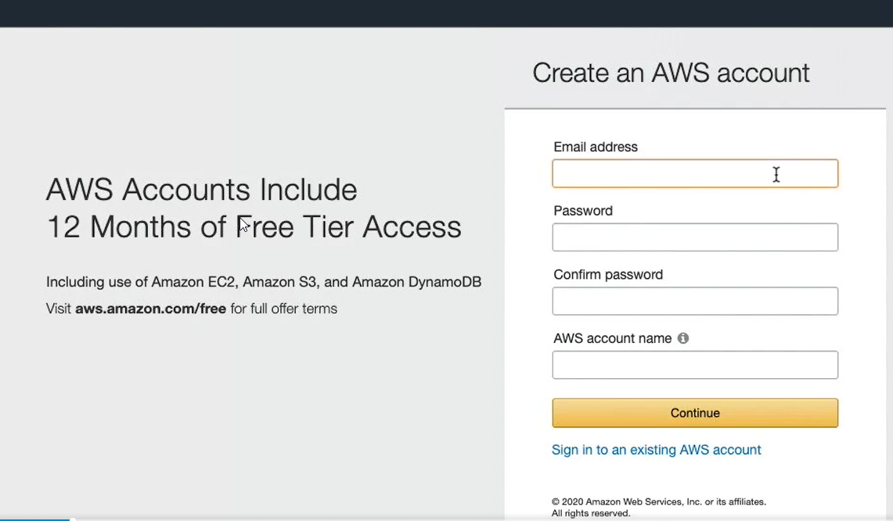
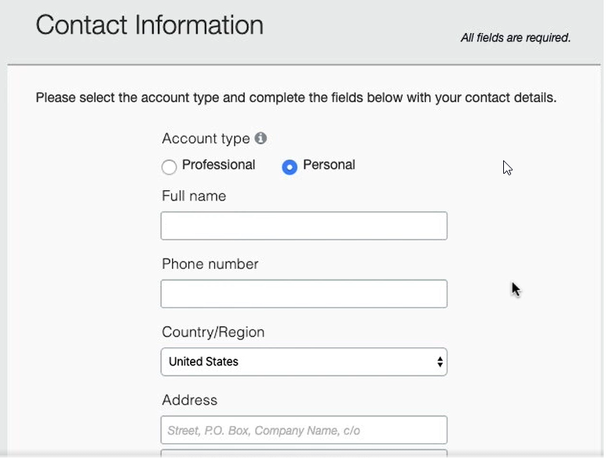
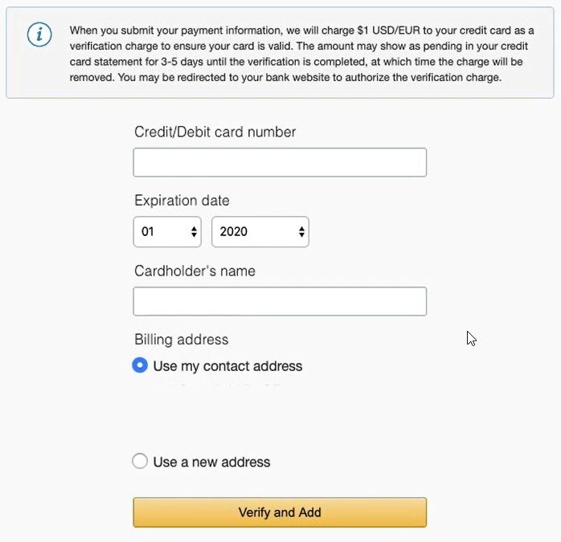
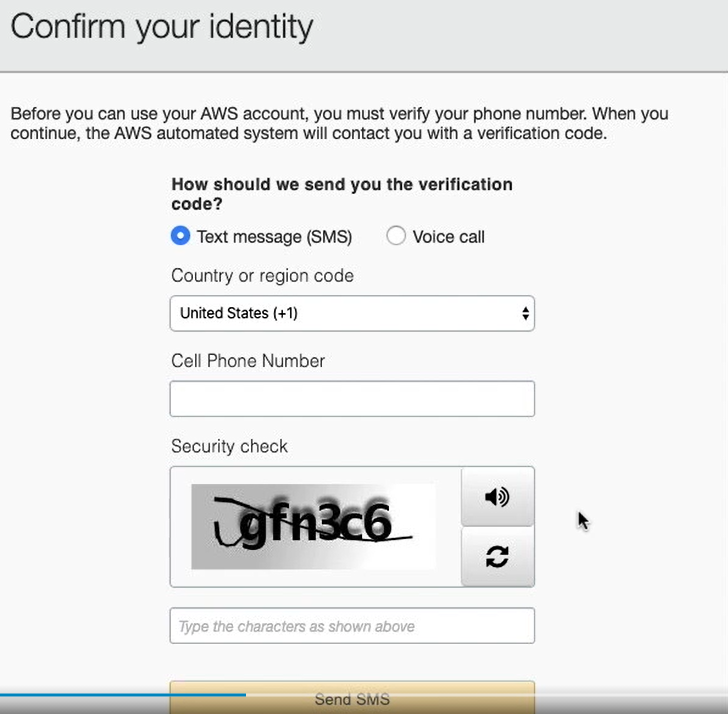
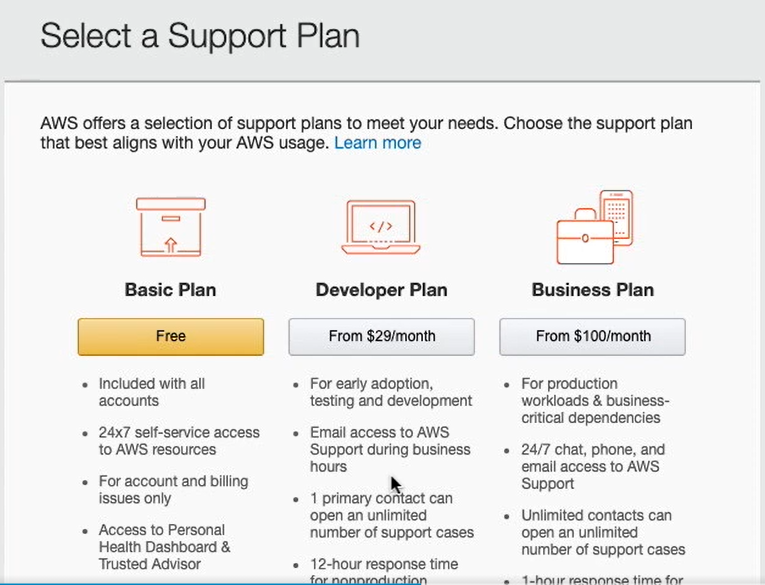

# Set budget alert for the created account

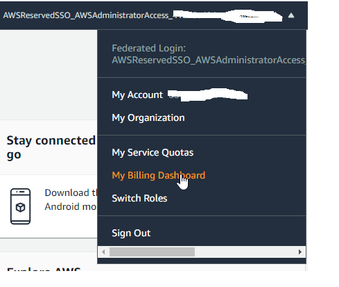
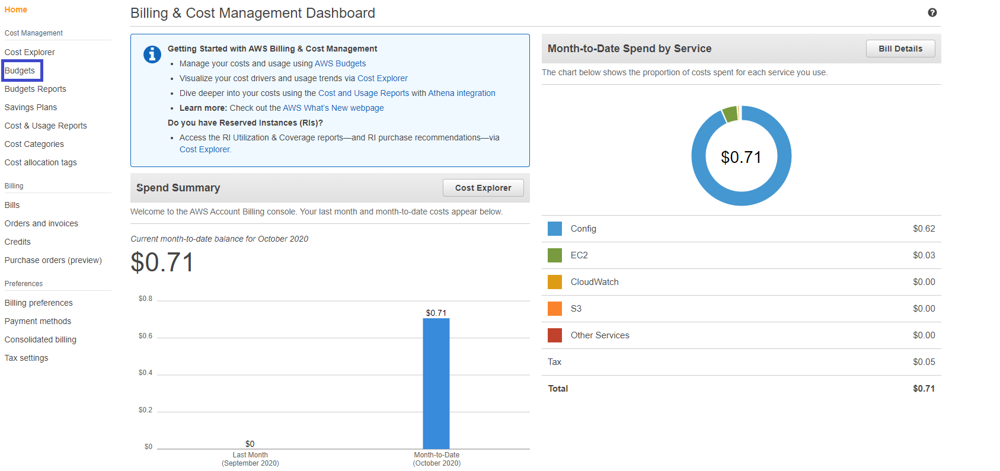
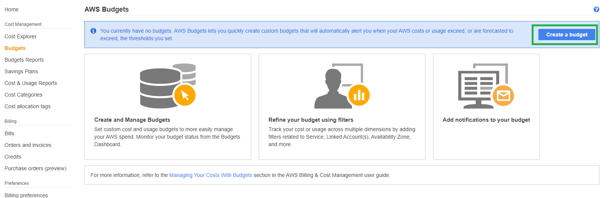
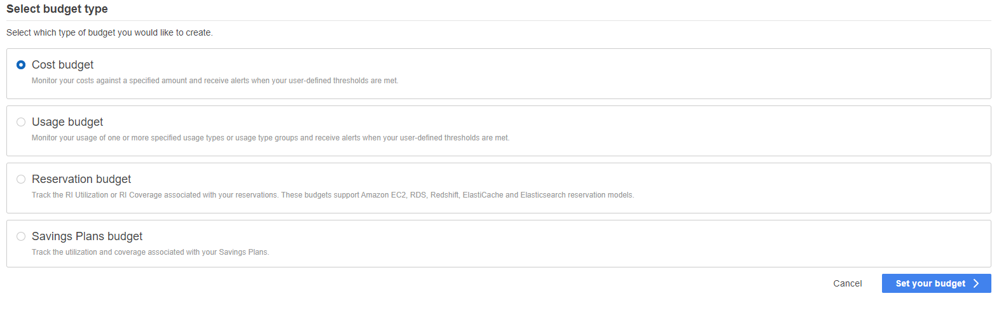
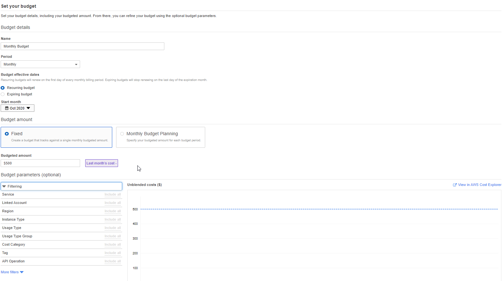

# Regions and Availability Zones and Edge Locations

## Regions
Each geographic location has a cluster of data centers that work together - this is called **region**. Region is much more then single data center.
AWS currently has 22 launched regions (2020) and some of them are public and some are not available to the public.

## Availability Zones
Regions operate with smaller units called **availability zones**.
Availability Zone consists of one or more data centers.
Multiple availability zones are included with each AWS Region.   

**At minimum each AWS Region has 2 availability zones.
At minimum each availability zone has at least one data center. So the smallest amount of data center that would support AWS region is 2.**

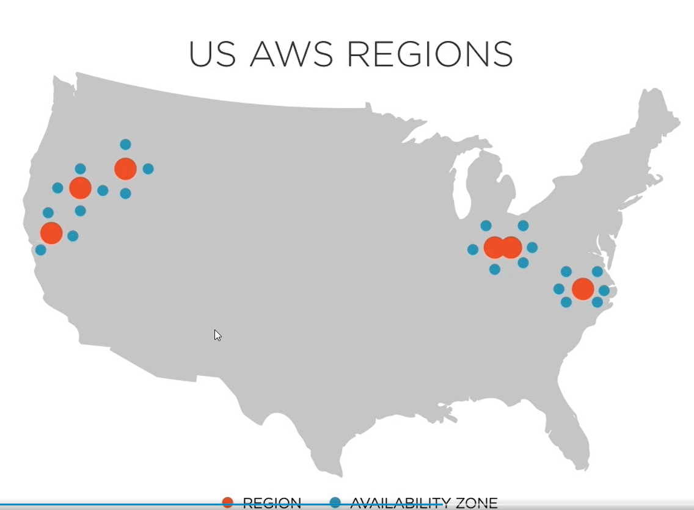

https://aws.amazon.com/about-aws/global-infrastructure/regions_az/?p=ngi&loc=2

## Naming

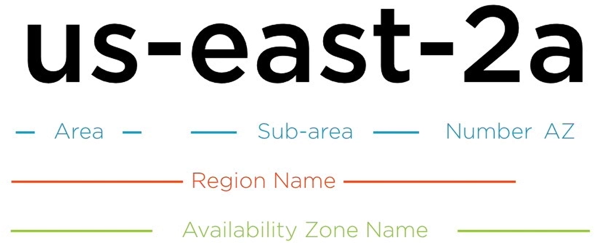

## AWS Edge Locations

Used as nodes of a global content delivery network (CDN).
They support to services:

* Amazon CloudFront: AWS CDN.
* Amazon Route 53: AWS DNS service.

**Thx to this AWS can serve content from locations which are closest to users.**   

http://infrastructure.aws/

There are 2 types of points of presence:
* Edge Locations
* Regional Edge Cache servers

# AWS Costs

## AWS TCO (Total Cost of Ownership) Calculator
Enables an organization to determine what could be saved by leveraging cloud infrastructure.   
http://awstcocalculator.com/

## AWS Simply Monthly Calculator
Enables an organization to calculate the cost of running specific AWS infrastructure.   
http://calculator.s3.amazonaws.com/

## AWS Resource Tags
Metadata assigned to a specific AWS resource. Includes a name and optional value.

Cost allocation report includes costs grouped by active tags.

# AWS Organizations
* Allows organizations to manage multiple accounts under a single master account.
* Provides organizations with the ability to leverage Consolidated Billing for all accounts.
* Enables organizations to centralized logging and security standards across accounts.

## AWS Cost Explorer

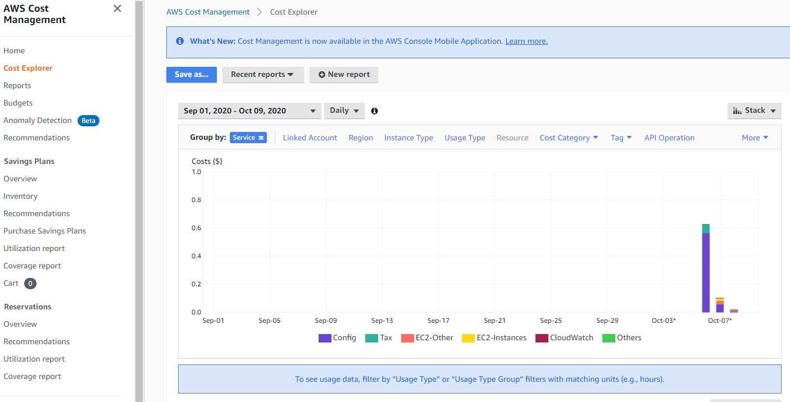

# AWS Support

## Differences between different support plans:
* communication method
* response time
* cost
* type of guidance offered

## AWS Basic Support
* provided for all AWS customers
* access to Trusted Advisor (7 Core Checks)
* 24x7 Access to customer service, documentation, forums & whitepapers
* access to AWS Personal Health Dashboard
* no monthly cost
* **NO access to AWS engineers**

## AWS Developer Support
* includes all features of Basic Support
* business hours email access to support engineers
* limited to 1 primary contact
* starts at $29 per month (tied to AWS usage)

## AWS Business Support
* includes all features of Developer Support
* full set of Trusted Advisor Checks
* 24x7 **phone**, email and chat access to support engineers
* unlimited contacts
* provides third-party software support
* starts at $100 per month (tied to AWS usage)

## AWS Enterprise Support
* includes all features of Business Support
* includes designated Technical Account Manager (TAM)
* includes concierge support team
* starts at $15 000 per month (tied to AWS usage)

## Support Response Times

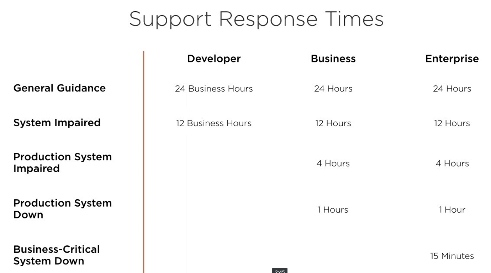

# AWS Support Tools

## Trusted Advisor

Information about my services. For example it can warn that there are specific ports unrestricted.

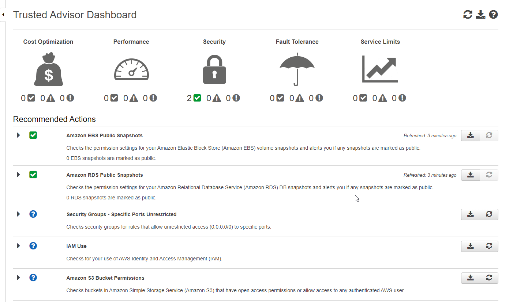

## Personal Health Dashboard

Information about health of AWS.

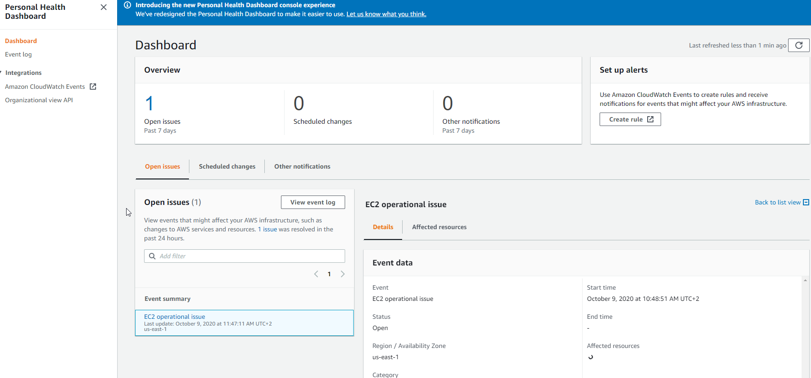

In tab **Affected resources** I can check if resources related with my account are impacted by some of these issues.

# resources
https://app.pluralsight.com/library/courses/fundamental-cloud-concepts-aws/table-of-contents   
